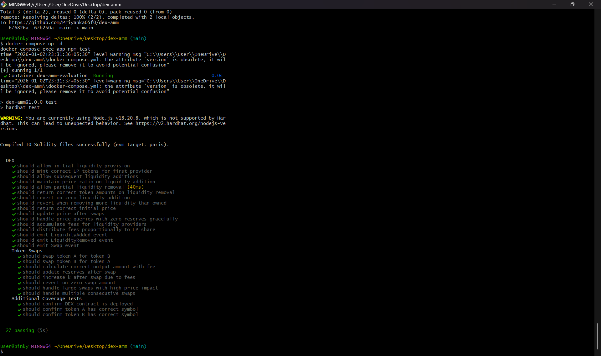
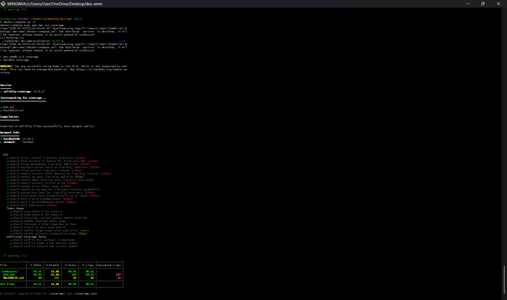
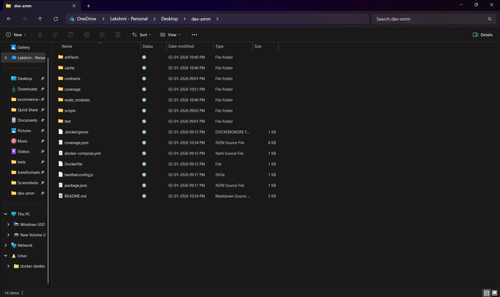

# DEX AMM Project

## Overview
This project implements a simplified Decentralized Exchange (DEX) using an Automated Market Maker (AMM) model similar to Uniswap V2. Users can provide liquidity, swap ERC-20 tokens, and earn fees without relying on centralized intermediaries.

## Features
- Initial and subsequent liquidity provision
- Liquidity removal with proportional share calculation
- Token swaps using constant product formula (x * y = k)
- 0.3% trading fee for liquidity providers
- LP token minting and burning

## Architecture
The system is centered around a single DEX smart contract that manages token reserves, liquidity accounting, and swap logic. ERC-20 tokens are used for testing via a mock token contract. Liquidity is tracked internally using mappings rather than a separate LP token contract to keep the design simple and auditable.

## Mathematical Implementation

### Constant Product Formula
The AMM follows the invariant:

x * y = k

Where:
- x = reserve of token A
- y = reserve of token B
- k = constant value that should not decrease

Swaps are calculated such that this invariant is preserved after accounting for fees.

### Fee Calculation
A 0.3% trading fee is applied to every swap.  
The fee is deducted from the input amount and remains in the liquidity pool, benefiting liquidity providers.

### LP Token Minting
- Initial liquidity providers receive LP tokens calculated using the geometric mean.
- Subsequent providers receive LP tokens proportional to their contribution relative to existing reserves.

## Setup Instructions

### Prerequisites
- Docker and Docker Compose installed
- Git

### Installation

1. Clone the repository:
```bash
git clone <your-repo-url>
cd dex-amm
```
2. Start Docker environment:
```bash
docker-compose up -d
```
3. Compile contracts:
```bash
docker-compose exec app npm run compile
```
4. Run tests:
```bash
docker-compose exec app npm test
```
5. Check coverage:
```bash
docker-compose exec app npm run coverage
```
6. Stop Docker:
```bash
docker-compose down
```
## Running Tests Locally (without Docker)
```bash
npm install
npm run compile
npm test
```
## Contract Addresses

If deployed to testnet, include addresses and block explorer links here.

## Known Limitations

- No frontend interface is included
- Price oracle is derived only from pool reserves
- Not optimized for production-level gas efficiency

## Security Considerations

- Solidity 0.8+ is used to prevent arithmetic overflow/underflow
- Input validation ensures non-zero and sufficient balances
- Events are emitted for all state-changing operations

---

## Implementation Details

### Mathematical Formulas

#### 1. Initial Liquidity (First Provider)
```ini
liquidityMinted = sqrt(amountA * amountB)
```

#### 2. Subsequent Liquidity Addition
The amounts must maintain the current price ratio:
```ini
amountB_required = (amountA * reserveB) / reserveA
```

#### LP tokens minted proportionally:
Withdraw proportional share:
```ini
liquidityMinted = (amountA * totalLiquidity) / reserveA
```

#### 3. Liquidity Removal:
```ini
amountA = (liquidityBurned * reserveA) / totalLiquidity
amountB = (liquidityBurned * reserveB) / totalLiquidity
```

#### 4. Token Swaps (with 0.3% fee):
The exact formula for output amount:
```ini
amountInWithFee = amountIn * 997
numerator = amountInWithFee * reserveOut
denominator = (reserveIn * 1000) + amountInWithFee
amountOut = numerator / denominator
```

This ensures:

- 0.3% fee is deducted (997/1000 = 99.7% of input is used)
- Fee remains in pool, benefiting LPs
- Constant product k slightly increases with each trade

--

## Implementation Guidelines

### Liquidity Management
- First liquidity provider can add any ratio
- Subsequent providers must match existing ratio or handle excess
- Use SafeMath or Solidity 0.8+ for overflow protection
- Emit events with all relevant parameters

### Swap Implementation
- Always deduct 0.3% fee from input amount first
- Apply constant product formula with fee-adjusted amount
- Update reserves after swap
- Verify `k` never decreases (except rounding)
- Emit Swap event with all details

### Security Best Practices
- Use OpenZeppelin’s ReentrancyGuard
- Use SafeERC20 for token transfers
- Validate all inputs (non-zero, sufficient balance)
- Check for arithmetic overflow/underflow
- Ensure proper access control

### LP Token Management
- Can be implemented within `DEX.sol` or as a separate contract
- Must be mintable/burnable only by the DEX contract
- Track each provider’s share accurately
- Handle edge case of first provider

---

## Common Pitfalls to Avoid

### 1. Integer Division
Solidity truncates. Always multiply before dividing:
```solidity
// Wrong: (a / b) * c
// Right: (a * c) / b
```

### 2. Reserve Synchronization
Always update reserves when tokens move:
```solidity
reserveA += amountA;
reserveB -= amountB;
```

## Verification Screenshots

### Test Results


### Coverage Report


### Project Structure

